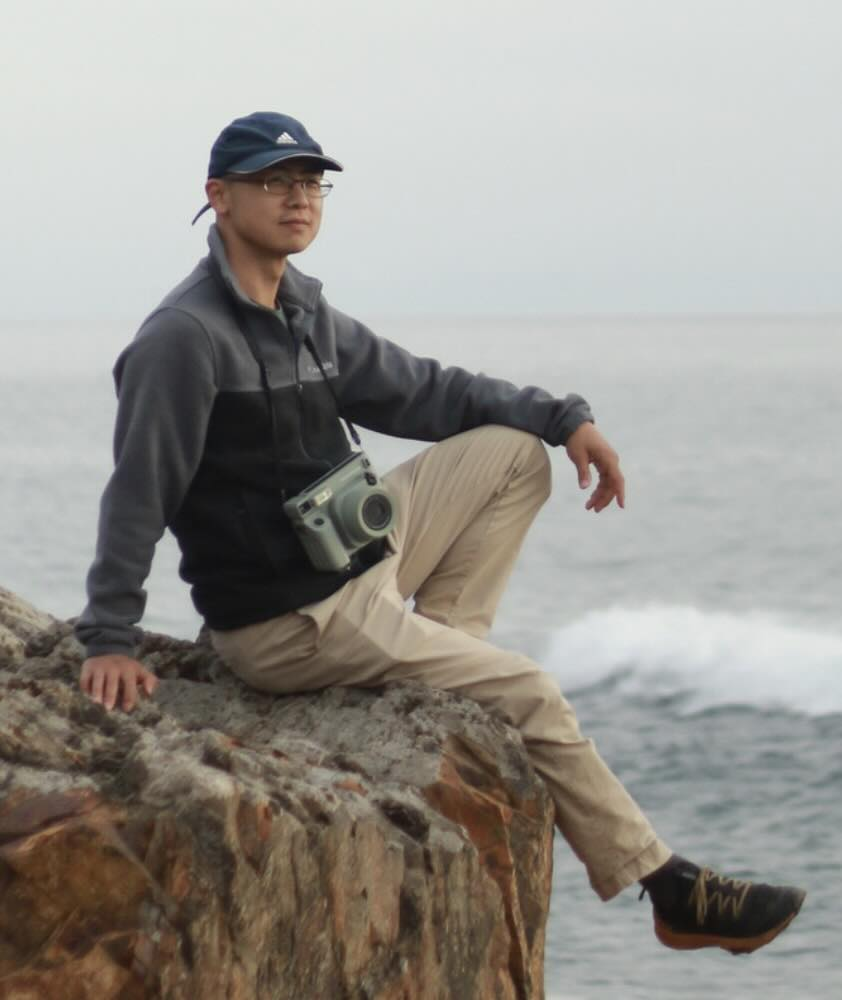

  
  

    <h1>Ruihua Fan</h1>
    

      Hello! I am a condensed matter theorist, interested in emergent phenomena in many-body systems, nature and even the human social behaviors! 
    

    
  
      Recent interests: various topics related to quantum Hall states, and more abstractly, chiral states. 
    

    
  
      You can find my papers on
      <a href="https://arxiv.org/a/0000-0003-0511-2581.html" target="_blank" rel="noopener">arXiv</a>
      or my
      <a href="https://scholar.google.com/citations?user=s8Vgp_UAAAAJ" target="_blank" rel="noopener">Google Scholar</a>.
    

    

      Email: ruihua_fan AT berkeley.edu
    

  

<h2 id="research-experience">Research experience</h2>

  <ul>
    <li>
      <strong>University of California, Berkeley</strong> 
      Moore postdoctoral fellow, Aug 2023 — current
    </li>
    <li>
      <strong>Harvard University</strong> 
      Postdoctoral fellow, June 2023 — July 2023
    </li>
  </ul>

<h2 id="education">Education</h2>

  <ul>
    <li>
      <strong>Harvard University</strong> 
      PhD in Physics, Aug 2017 — May 2023 
      Advisor:
      <a href="https://www.physics.harvard.edu/people/facpages/vishwanath" target="_blank" rel="noopener">
        Prof. Ashvin Vishwanath
      </a>
    </li>
    <li>
      <strong>Institute of Advance Study, Tsinghua University</strong> 
      Undergraduate student, Apr 2015 — Aug 2017 
      Advisor:
      <a href="https://www.ias.tsinghua.edu.cn/en/info/1059/1170.htm" target="_blank" rel="noopener">
        Prof. Hui Zhai
      </a>
    </li>
    <li>
      <strong>Peking University</strong> 
      B. Sc in Physics, Sep 2013 — July 2017
    </li>
  </ul>

